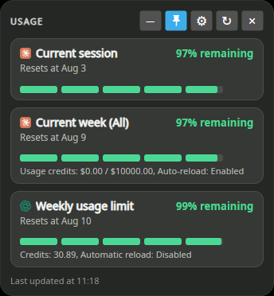
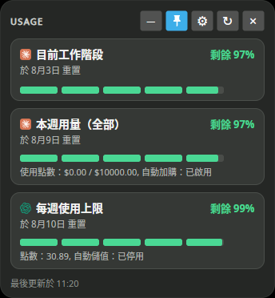
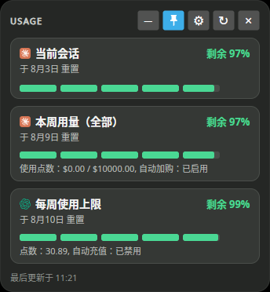

# Claude Codex Usage Companion Linux 版

[English](README.md) · [简体中文（zh-cn）](README.zh-CN.md)

Claude Codex Usage Companion 是一套在 Linux 上執行的本機開源 Claude Code 與 Codex 用量監視器，包含：

- 以 Avalonia 建置、小巧且永遠置頂的桌面輔助面板。
- 支援單次輸出、JSON 與即時監看的可編寫指令碼 CLI。
- Codex `SessionStart` 與 `Stop` hooks，用來啟動或重新整理單一常駐 GUI 程序。
- Claude Code 與 Codex 用量會顯示在同一面板中——兩者預設皆為啟用，並可在設定中個別關閉。
- 英文、繁體中文與簡體中文用量文字。
- 分類顯示的設定視窗，可設定語言、主題、視窗位置、低用量通知、重置通知、用量記錄、工作列與系統匣圖示、登入時自動啟動與永遠置頂行為。
- 四種系統匣圖示樣式：原始圖示、Claude 目前工作階段剩餘用量、Claude 每週剩餘用量或 Codex 工作階段剩餘用量。
- 不含遙測，本程式也不會自行儲存任何驗證 token。

此 Linux 移植版以 [gkfriend/codex-usage-companion](https://github.com/gkfriend/codex-usage-companion) 為基礎；原始實作以 Windows/WPF 為目標。

## 螢幕截圖

| 英文（`en-US`） | 繁體中文（`zh-tw`） | 簡體中文（`zh-cn`） |
| --- | --- | --- |
|  |  |  |

## 系統需求

- Kubuntu 26.04 或其他新式 x64/ARM64 Linux 發行版。
- X11 或支援 XWayland 的 Wayland 桌面環境（Kubuntu 預設支援）。
- 已安裝並完成驗證的 Codex CLI，且可透過 `PATH` 中的 `codex` 執行。
- `.deb` 套件需要：`libx11-6`、`libice6`、`libsm6`、`libfontconfig1`、`libharfbuzz0b`、`fonts-noto-cjk` 與 `libnotify-bin`。

Release 套件為自包含套件，不需要另外安裝 .NET runtime。

## 安裝並驗證 Codex CLI

Claude Codex Usage Companion 需要官方 Codex CLI 及其 `app-server` 子命令。請使用[官方安裝程式](https://developers.openai.com/codex/cli)在 Linux 上安裝或更新至最新版 Codex CLI：

```bash
curl -fsSL https://chatgpt.com/codex/install.sh | sh
```

安裝完成後開啟新的終端機，接著使用 ChatGPT 或其他可用的驗證方式登入：

```bash
codex login
```

驗證執行檔路徑、版本、登入狀態，以及必要的 `app-server` 子命令：

```bash
command -v codex
codex --version
codex login status
codex app-server --help >/dev/null && echo "Codex app-server is available"
```

第一個命令應輸出絕對路徑，第二個命令應輸出版本，第三個命令應確認目前的驗證方式，最後一個命令應輸出可用訊息。如果 `command -v codex` 沒有輸出，請開啟新的終端機，並確認安裝程式顯示的安裝目錄已加入 `PATH`。

此程式也會搜尋 `~/.local/bin`、`~/.npm-global/bin` 與 `~/.codex/bin`。如果 Codex 安裝在其他位置，請設定 `CODEX_CLI_PATH=/absolute/path/to/codex`。

## 啟用 Claude 用量（選用）

Claude Code 用量預設會與 Codex 一起顯示。若要使用，請先安裝並登入 [Claude Code](https://code.claude.com)，執行一次 `claude` 讓它寫入 `~/.claude/.credentials.json`。若您不使用 Claude Code，可在設定中關閉**啟用 Claude 用量顯示**（或在 `settings.json` 中設定 `"enableClaudeUsage": false`）；對應的**啟用 Codex 用量顯示**核取方塊則可用同樣方式關閉 Codex 區塊。

Claude Code 並沒有官方 API 可供查詢用量，這點與 Codex 不同。本程式會讀取 Claude Code 本身已儲存在本機的 OAuth access token，直接呼叫 Anthropic 自家（未公開文件記載）的用量端點——程式本身不會讀取以外的用途、寫入或重新整理該憑證檔案。若 token 已過期，會顯示錯誤訊息請您重新執行 `claude`，而不會嘗試自行重新整理該工作階段。由於該端點未公開文件記載，未來可能在未通知的情況下變更；無論設定的更新間隔為何，Claude 用量最多每 180 秒查詢一次。若 Claude 或其憑證檔案安裝在程式預設搜尋位置（`~/.local/bin`、`~/.npm-global/bin`、`~/.claude/local`）以外，請設定 `CLAUDE_CREDENTIALS_PATH=/absolute/path/to/.credentials.json` 或 `CLAUDE_CLI_PATH=/absolute/path/to/claude`。

## 安裝桌面程式與 CLI

從較舊的套件升級：本專案已重新命名兩次（`codex-usage-companion` → `codex-claude-usage-companion` → `claude-codex-usage-companion`）。安裝新版 `.deb` 之前，請先執行 `sudo apt remove codex-usage-companion` 及／或 `sudo apt remove codex-claude-usage-companion`（視目前安裝的版本而定）。每次重新命名都使用不同的套件名稱，因此 `apt` 不會自動取代舊版；若同時保留舊版，開機時會啟動兩個常駐系統匣程序。新套件首次執行時，會自動從偵測到的任一舊版設定檔遷移既有設定。

建置或下載 `.deb`，然後執行：

```bash
sudo apt install ./claude-codex-usage-companion_0.1.0_amd64.deb
```

從 KDE 應用程式選單啟動 **Claude Codex Usage Companion**，或執行：

```bash
claude-codex-usage-companion gui
```

套件也會安裝較短的 `claude-codex-usage` 別名。

`.deb` 會在 `/usr/share/applications/claude-codex-usage-companion.desktop` 建立 KDE/GNOME 應用程式選單項目，並將圖示安裝至 `/usr/share/icons/hicolor/scalable/apps/`。登入時自動啟動預設為停用。在設定視窗中啟用後，程式會建立 `${XDG_CONFIG_HOME:-$HOME/.config}/autostart/claude-codex-usage-companion.desktop`。

啟用登入時自動啟動後，會顯示「**最小化視窗**」選項（未啟用時則隱藏）。兩者皆啟用時，程式會在登入時啟動並不顯示視窗——用量仍會在背景持續更新——之後只要重新開啟程式（透過應用程式選單、系統匣圖示，或再次執行程式）即可讓視窗重新顯示。

使用 **⚙ 設定** 按鈕即可設定工作列圖示、系統匣、系統匣圖示樣式、登入時自動啟動、語言、主題、視窗位置、低用量通知、重置通知、用量記錄與永遠置頂行為。**確定**會套用變更並關閉視窗，**取消**會捨棄尚未套用的變更，**應用**則會儲存變更但保持視窗開啟。

## CLI

輸出目前的額度：

```bash
claude-codex-usage status
```

回傳機器可讀的 JSON：

```bash
claude-codex-usage status --json
```

每 30 秒持續重新整理終端機：

```bash
claude-codex-usage watch --interval 30
```

輸出設定檔路徑與實際套用的設定：

```bash
claude-codex-usage config
```

`status`、`watch` 及其 `--json` 輸出會先顯示 Claude 再顯示 Codex，與面板的卡片順序一致。`--json` 會巢狀輸出為 `{"claude": {"state": ..., "error": ...}, "codex": {"state": ..., "error": ...}}`（任一供應商停用時，對應欄位會完全省略）——這是相對於先前扁平 `--json` 結構的重大變更。

若 Codex 不在 `PATH` 中，請設定 `CODEX_CLI_PATH=/absolute/path/to/codex`。若要停用 ANSI 色彩，請設定 `NO_COLOR=1` 或傳入 `--no-color`。

## 安裝為 Codex plugin

Linux release 建置會產生 `CodexUsageCompanionMarketplace-v0.1.0-linux-x64.zip`。解壓縮後，加入解壓縮的 marketplace，然後安裝並啟用 plugin：

```bash
codex plugin marketplace add /path/to/extracted-marketplace
```

Codex 詢問時，請檢閱並信任隨附的 `SessionStart` 與 `Stop` hooks。透過 plugin 啟動程式時，設定會使用 `PLUGIN_DATA`。

## 設定

預設設定檔位於：

```text
${XDG_CONFIG_HOME:-$HOME/.config}/claude-codex-usage-companion/settings.json
```

```json
{
  "showFiveHourLimit": false,
  "enableClaudeUsage": true,
  "enableCodexUsage": true,
  "enableSystemTray": false,
  "trayIconStyle": "original",
  "showTaskbarIcon": true,
  "startOnBoot": false,
  "minimizeOnStart": false,
  "language": "en-US",
  "theme": "system",
  "enableLowUsageAlert": false,
  "lowUsageAlertThresholdPercent": 20,
  "notifyOnReset": false,
  "enableUsageLogging": false,
  "usageLogFilePath": "/home/you/.local/state/claude-codex-usage-companion/usage-history.csv",
  "usageLogFormat": "csv",
  "position": "right-bottom",
  "opacity": 1.0,
  "margin": 16,
  "alwaysOnTop": true,
  "refreshIntervalSeconds": 60,
  "resetDateTimeFormat": "MMM D",
  "lastUpdatedDateTimeFormat": "HH:mm"
}
```

語言值：`en-US`、`zh-tw`、`zh-cn`。首次執行時，系統語言為 `zh-TW`、`zh-HS`、`zh-Hant`、`zh-HK`、`zh-MO` 與其他繁體中文文化特性時，預設使用 `zh-tw`；系統語言為 `zh-CN`、`zh-Hans`、`zh-SG` 與其他簡體中文文化特性時，預設使用 `zh-cn`；其他語言則預設使用上方所示的 `en-US`。仍接受舊版的 `auto` 與 `en` 值，且語言值比對不分大小寫。

主題值：`dark`、`light`、`system`。`system` 是預設值，會跟隨桌面目前的淺色或深色偏好設定。

系統匣圖示樣式值為 `original`、`claude-current-session`、`claude-weekly-session` 與 `codex-session`。數字樣式會在深色背景上顯示粗體、反鋸齒的七段顯示器數字，且不顯示百分比符號。Codex 工作階段會優先使用 5 小時視窗，若未提供則改用每週用量。

位置值：`left-top`、`middle-top`、`right-top`、`left-center`、`middle-center`、`right-center`、`left-bottom`、`middle-bottom`、`right-bottom`。

選擇位置後會立即預覽。按下 **確定** 或 **應用** 會保留新位置；按下 **取消** 會還原至最近一次套用的位置。程式仍接受 `top-left` 與 `bottom-right` 等舊版角落位置值。

GUI 全域提供鍵盤快捷鍵。在主視窗中，按 `S` 開啟設定、按 `Ctrl+R` 重新整理用量，或按 `Esc` 關閉視窗。在設定視窗中，按 `Ctrl+S` 儲存，或按 `Esc` 關閉。若關閉設定時仍有未儲存的變更，程式會先要求確認，避免直接捨棄變更。

**更新間隔** 設定提供 1 至 60 分鐘的常用值。目前的 1 分鐘間隔是預設值與最小值；先前儲存在此範圍內的自訂間隔仍可選取。

低用量通知預設為停用。啟用後，5 小時或每週剩餘用量一旦嚴格低於設定的 `1`–`100` 百分比門檻，就會發送一次桌面通知；當該額度回升至門檻或以上時會重新啟用通知。重置通知可獨立設定且預設為停用，重新整理後確認新的重置週期時會發送通知。

重置日期時間預設格式包括 `MMM D`（預設）、`MMM D HH:mm`、`yyyy-MM-dd` 與 `yyyy-MM-dd HH:mm`。最後更新預設格式包括 `HH:mm`（預設）、`HH:mm:ss`、`MMM D HH:mm` 與 `yyyy-MM-dd HH:mm`。兩個下拉式方塊也接受自訂 .NET 日期時間格式字串，並支援以大寫 `D` 作為日期中的日。輸入時會顯示在地化預覽以檢查格式；格式錯誤時會顯示錯誤並停用 **確定** 與 **應用**。月份名稱與日期表示方式會依語言在地化。

不透明度限制為 `0.5`–`1.0`，邊距限制為 `0`–`64` 像素，更新間隔限制為 `60`–`3600` 秒。

`enableClaudeUsage` 與 `enableCodexUsage`（預設皆為 `true`）可各自獨立顯示或隱藏對應供應商的區塊；面板高度會自動調整。無論設定的更新間隔為何，Claude 最多每 180 秒查詢一次——詳見[啟用 Claude 用量（選用）](#啟用-claude-用量選用)。

## 用量更新記錄

用量記錄預設為停用。啟用後，每次成功重新整理與重新整理錯誤都會附加至指定檔案。CSV 是預設格式，預設路徑遵循 `${XDG_STATE_HOME:-$HOME/.local/state}/claude-codex-usage-companion/usage-history.csv`。

支援的格式為 `txt`（每行一筆鍵值記錄）、`csv`（標頭後接資料列）與 `jsonl`（每行一個 JSON 物件）。變更格式時，設定的檔名副檔名會自動改為 `.txt`、`.csv` 或 `.jsonl`。記錄包含更新時間、該筆記錄屬於哪個供應商（`claude` 或 `codex`）、成功或錯誤狀態、5 小時與每週剩餘百分比和重置時間、可用重置點數，以及任何重新整理錯誤。相對路徑會以應用程式的 XDG state 目錄為基準解析。對於既有記錄檔的剖析程式而言，新增的 `provider` 欄位屬於重大變更。

## 建置

安裝 .NET 10 SDK 或更新版本，然後執行：

```bash
bash scripts/build-linux.sh
```

ARM64：

```bash
bash scripts/build-linux.sh linux-arm64
```

建置程序會執行測試套件，並在 `artifacts/` 下輸出 `.deb`、可攜式 `.tar.gz`、Codex marketplace `.zip` 與校驗碼。

開發環境執行方式：

```bash
dotnet run --project src/CodexUsageCompanion -- status
dotnet run --project src/CodexUsageCompanion -- gui
```

## Linux 行為

GUI 使用 `XDG_RUNTIME_DIR` 下僅限擁有者存取的 Unix socket，以確保只執行一個實例並接收重新整理訊號。設定遵循 XDG config 慣例；有限大小的記錄檔儲存在 `${XDG_STATE_HOME:-$HOME/.local/state}/claude-codex-usage-companion`。

Avalonia 在 Linux 上預設使用 X11/XWayland。Wayland compositor 可能會套用自己的視窗定位或永遠置頂政策。面板仍可拖曳，並包含最小化、釘選置頂、設定、重新整理與關閉控制項。標題列的釘選按鈕、設定視窗的「視窗永遠置頂」核取方塊，以及系統匣選單的「視窗永遠置頂」核取方塊都會反映並更新同一項設定。Claude 的**目前工作階段**／**本週用量（全部）**區塊會顯示在最前面，其後才是 Codex 區塊。已購買的**點數**會顯示在 Codex 每週用量條下方，固定保留兩位小數，格式為 `點數：23.75, 自動儲值：已啟用/已停用`；未提供自動儲值狀態時會顯示為`已停用`。Claude 的每週卡片會顯示 `使用點數：6.32 / 100.00, 自動加購：已啟用/已停用`，反映其選用的按量加購額度（已花費金額對比每月上限，而非預付餘額）。每張卡片標題會顯示對應供應商自己的圖示（Claude 標誌或 OpenAI 標誌）。系統匣預設為停用：關閉面板會結束常駐程序。啟用系統匣後，關閉會隱藏面板並保留最新用量快照；隱藏期間仍會依更新間隔在背景更新，並接收 Codex 用量限制通知。按一下系統匣圖示、選擇 **顯示視窗**，或再次啟動程式時，會還原快取狀態而不立即重新擷取。系統匣選單包含**顯示視窗**、**重新整理使用量**、**視窗永遠置頂**、**開機時自動啟動**、**設定**與**結束**，並以分隔線區分操作群組。選擇 **結束** 才會停止程序。系統匣提示會先顯示應用程式名稱，接著每個用量視窗各佔一行，格式為 `[Claude] 目前: 剩餘 d% (於 ... 重置)`、`[Claude] 每週: 剩餘 d% (於 ... 重置)`、`[Codex] 每週: 剩餘 d% (於 ... 重置)`，最後是使用所選最後更新日期時間格式的 `最後更新於 HH:mm`。

程式會從本機 `codex app-server` 程序讀取 `account/rateLimits/read`。此 API 可能演進，因此未來的 Codex release 可能需要相容性更新。Claude 用量仰賴 Anthropic 未公開文件記載的端點（參見[啟用 Claude 用量（選用）](#啟用-claude-用量選用)），該端點可能在未通知的情況下變更。

## 隱私與授權

請參閱 [PRIVACY.md](PRIVACY.md)、[SECURITY.md](SECURITY.md) 與 [MIT License](LICENSE)。
